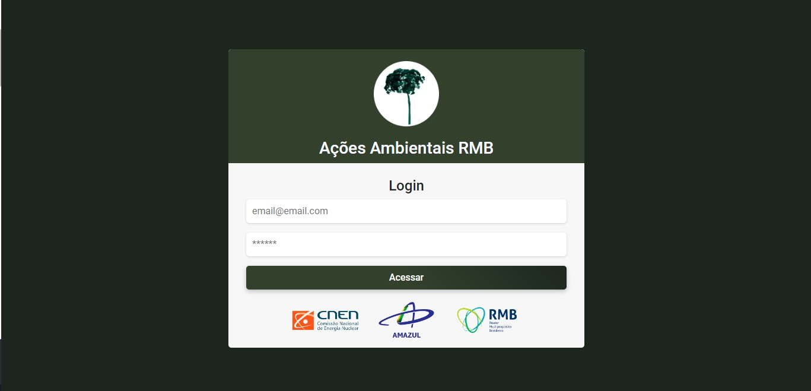
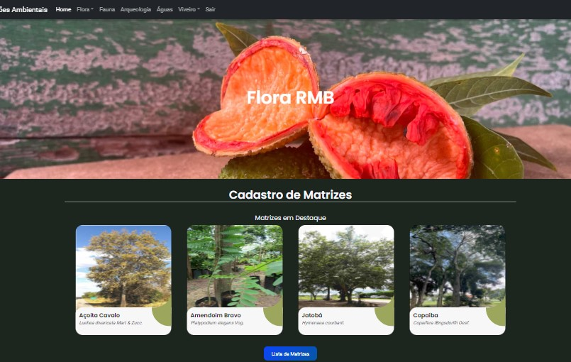
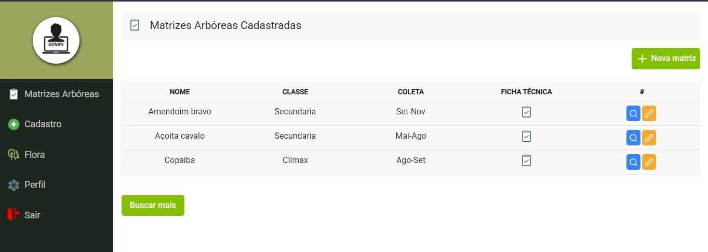
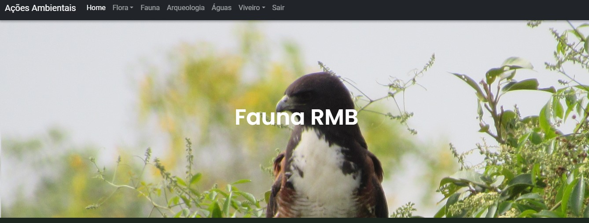
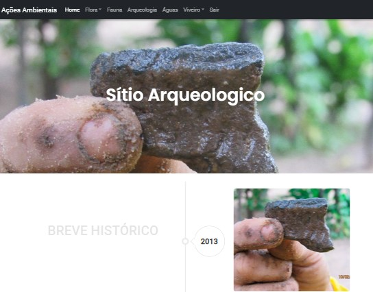
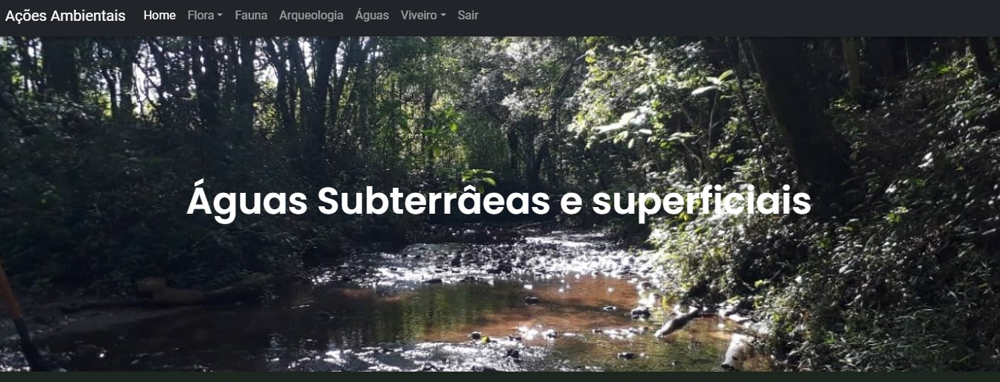

<h1 id='acoes'>🌱 Ações Ambientais RMB</h1>

> A plataforma é uma ferramenta desenvolvida para auxiliar as atividades da GI no Sítio RMB relacionadas a manutentção dos Planos Ambientais.

> 
> visão da página Home

<h2> 📁 Páginas:</h2>
Abaixo você encontrará informações sobre cada página disponível na plataforma.

<h3> 🏠 Pagina Home</h3>

> 🔒 Antes de acessar a plataforma o usuário deve confirmar suas credenciais .
> 

> Seções:

1. Área de Login;
2. Banner Inicial - Aqui é apresentado o título da ferramenta e os stakeholders;
3. <a href='#flora'>Flora</a>
4. <a href='#fauna'>Fauna</a>
5. <a href='arqueologia'>Sítio Arqueologia</a>;
6. <a href='#aguas'>Águas Subterrâneas e Superficiais</a>
7. RMB informa - Links importantes e parceiros técnicos.

<h3 id='flora'>📗 Página Flora</h3>

> Apresentação das atividades desenvolvidas pela GI no ambito da Gestão dos planos ambientais referentes a Flora;

> 

> Seções:

1.  Matrizes Cadastradas em destaque.

2.  Áreas de plantio com :

    - Mapas das 20 áreas de plantio.
    - Mapa do Viveiro Piloto de produção de mudas.
    - Mapa da Área de Rustificação de mudas.

3.  Link do GoogleMaps com o Bosque dos Pioneiros em tempo real.

4.  Dicas sobre identificação de Matrizes;

<h3 id='cadastro'>📗 Página de Cadastro de Matrizes</h3>

> Adicionalmente a página Flora, a plataforma conta com uma área para cadastro de Matrizes arbóreas.
> 

> Seções:

1.  Lista de Matrizes Cadastradas.
2.  Área de Cadastro de Matrizes no Banco de Dados:
3.  Área de perfil do usuário.

<h3 id='fauna'>📗 Página Fauna</h3>

> Avistamento de fauna na ADA e AID do Sítio RMB e Matriz de avistamento do Projeto FLONA
> 

<b>Em construção 🚧</b>

<h3>📗 Página Arqueologia</h3>

> Breve histórico sobre a prospecção da área e diretrizes para caso encontre um possível artefato.
> 

> Seções:

1. Timelime da Prospecção Arqueológica.
2. O que fazer ao encontrar um artefato.

<h3 id='aguas'>📗 Página Águas Subterrâneas e Superficiais</h3>

> Mostrará pontos de coleta de amostragem de águas do sítio
> 

<b>Em construção 🚧</b>
 

<h2>🔧 Ajustes e Melhorias</h2>

> ⚠️ O portal ainda está em desenvolvimento e as próximas features serão implementadas conforme a solicitação e demanda da Gerência de implatação.

<h2>📝 Licença de Uso</h2>

> Esse projeto está sob licença e cuidados da Gerência de Implatação da Amazul. Para solicitar acesso ou sugerir melhoria favor contatar a GI.

[⬆ Voltar ao topo](#acoes) 
